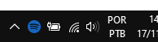
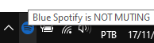
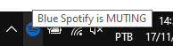

  

  

# Blue Spotify

  

A python GUI/script that mutes when Spotify ad plays

 

  
  
  
  

***

## 🤔 How to use

Requirements:

-   None

just double-click the [Blue Spotify](/Blue%20Spotify.exe) and be happy 😀.

---

## 🤝 Contributing

Contributions, issues and feature requests are welcome! Feel free to check [issues page](https://github.com/abacaxiguy/blue_spotify/issues).

---

## 📋 Tested in

- Windows 10

***
<h4  align="center">Developed by 🍍</h4>
